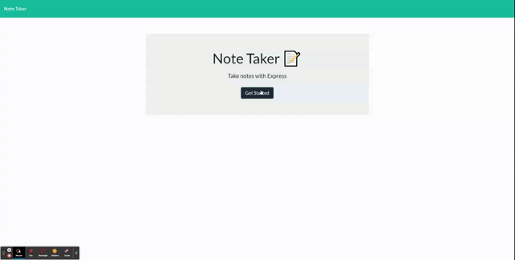

# Notepad 
  
  
  ## Description:  
  A small note taking site, that can store information. 

  ## Table of Contents:  
  - [Description](#-description)
  - [Table of Contents](#-table-of-contents)
  - [Installation](#-installation)
  - [Usage](#-usage)
  - [License](#-license)
  - [Contributing](#-contributing)
  - [Tests](#-tests)
  - [Questions](#-questions)

  ## Installation:  
  1. go to the Github repo. 2. Clone the repo. 3. install the dependencies. 4. Run with: node server.js in the terminal.

  ## Usage:  
  Go to the site page,(or localhost:3000 if running locally) and click on get started.
  
  ## License:  
  Licensed under [MIT](./LICENSE)
  
  ## Contributing:  
  This was a solo project by Wells Wu. Dependencies required: npm express, uid, and path. Code based of off instructor Quinton Fults' example
  
  ## Tests:  
  To jot down a note that can be referred back to later

  
  
  ## Questions:  
  Contact Me: [Github](https://gist.github.com/WellsWu4621), or Email Me @wellswu.dev@gmail.com  
  Repository Link [Note Taker](https://github.com/WellsWu4621/Notepad)
  Deployed Server: [Note Taker](https://damp-thicket-96083.herokuapp.com/)

